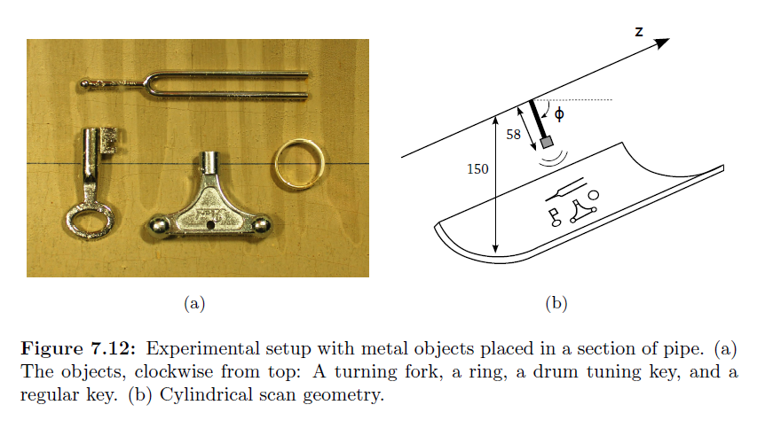

**License:** 

# Summary
Synaptus is a Matlab/Octave toolbox for synthetic aperture or array imaging. It was originally developed for ultrasonic imaging for non-destructive testing, but can be applied for similar imaging modes (e.g. ground penetrating radar). The toolbox focuses on algorithms implemented in the Fourier domain and on multilayered structures (e.g. water, metal, rock). 

# Background
The toolbox was originally written by Martin H. Skjelvareid, as a collection of algorithms developed during his work as a PhD candidate. The PhD thesis is included in the "docs" folder, and can also be downloaded from https://hdl.handle.net/10037/4649 . As with so many things, "the devil is in the details" when it comes practical implementation of synthetic aperture algorithms. The toolbox is meant to help people who are new to the field and are looking to make implementations of published algorithms. The data sets included in the toolbox will hopefully be useful in the development of new algorithms for similar measurement geometries. The toolbox could also represent a collection of reference methods against which new algorithms are compared.

The name of the toolbox is an abbreviation of "Synthetic APerTure UltraSound".

# Algorithms
The main focus of the algorithms is on Fourier-domain synthetic aperture processing of ultrasound data. Fourier-domain processing is very common for synthetic aperture radar and sonar, but in the field of ultrasound, the time-domain "delay-and-sum" approach still dominates. With Fourier-domain processing, it is possible to extrapolate a sampled pulse-echo wavefield in both space and time ("wavefield migration"). One major advantage of this approach is that the wavefield is easily extrapolated between media with different wave velocities, enabling multi-layer imaging (very relevant for immersion ultrasound imaging).

The phase shift migration (PSM) algorithm works by migrating the recorded wavefield in small steps, and creating a focused image line/plane at each depth (using the "exploding reflector model"). From a processing standpoint, the method is not optimal, as the complete wavefield spectrum matrix has to be multiplied with a phase factor matrix at each step. However, since matrix multiplication is very fast in Matlab/Octave, the method is quite fast in practice.

The MULOK algorithm is a multi-layer version of the method known as Stolt migration, omega-k focusing, f-k focusing, etc. (several names exist for the same method). The wavefield extrapolation used in PSM is also used in MULOK, to extrapolate the wavefield between layers with different wave velocities. However, each layer is focused "all at once" by a resampling of the wavefield spectrum. This is generally a quite efficient method, but the practical performance very much depends on the efficiency of the interpolation method used (the linear interpolation mode of the interp1 function in Octave/Matlab is only moderately fast).

The CPSM algorithm is an adaptation of the PSM algorithm to a cylindrical imaging geometry (transducer pointing outward from cylindrical scanning surface). The solutions to the wave equation in a cylindrical geometry are Hankel functions. These can be used to extrapolate the wavefield, but are generally very time-consuming to compute. The algorithm also includes two alternative transfer functions which are approximate but much faster.

# Example raw and focused image
The following images are taken from chapter 7 of the thesis to illustrate one application (of many) of the algorithms in the toolbox.

The images below show raw and focused ultrasonic images.

Again note that this is only a single example, chosen because it is visual and intuitive. It does not illustrate how the toolbox also can handle cartesian geometries and multilayered media.

# Organization
The toolbox is organized into the following folders:
- 'core' contains the functions for synthetic aperture focusing. Each file represents a separate algorithm.
- 'datasets' contains datasets in .mat-format, used for test/demonstration of the algorithms
- 'test' contains test scripts for the algorithms
- 'misc' contains various function used to help in processing and plotting of results.
- 'learn' contains simplified versions of (some of) the algorithms in the toolbox, with additional plots of data at intermediate steps to help understanding.
- 'docs' contains relevant documentation (PhD thesis ++)
- 'experimental' contains "draft" code related to smaller concepts and ideas, including tilt compensation. The code is not fully polished/commented.

# Contributing
Contributions to the toolbox are most welcome; bug reports, suggestions for changes, datasets, new algorithms - anything you think is relevant. See [CONTRIBUTING](CONTRIBUTING.md) file for further details.

# Acknowledgements
- The main elements of the toolbox were developed by M. H. Skjelvareid, working as an industrial PhD working at Breivoll Inspection Technologies (BIT) in Tromsø, Norway. The work was financed in equal parts by BIT and the Norwegian Research Council.
- M. H. Skjelvareid owes great thanks to Tomas Olofsson, who introduced him to phase shift migration and collaborated with him on multiple publications, and to Yngve Birkelund and Yngvar Larsen, who were his PhD advisors and co-authors.
