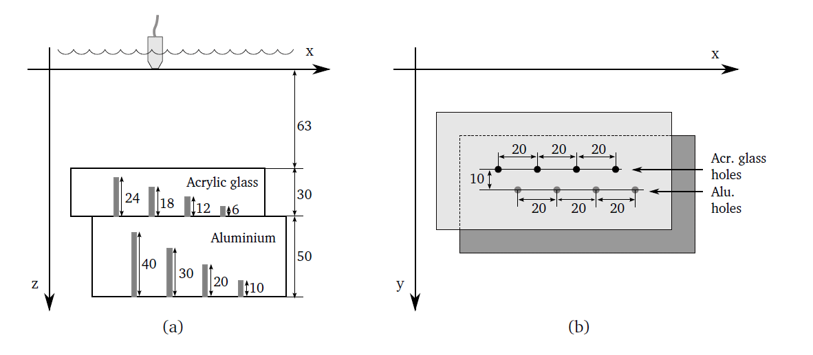
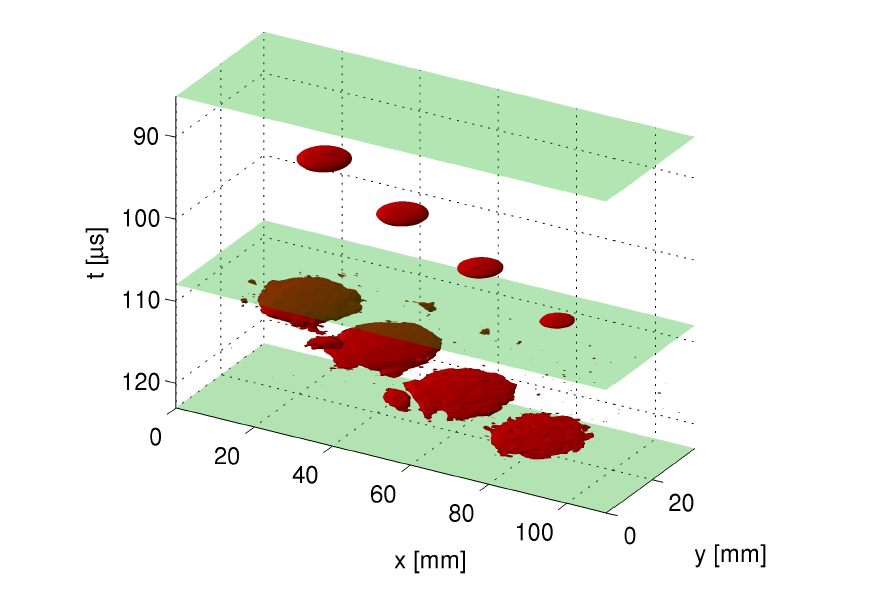
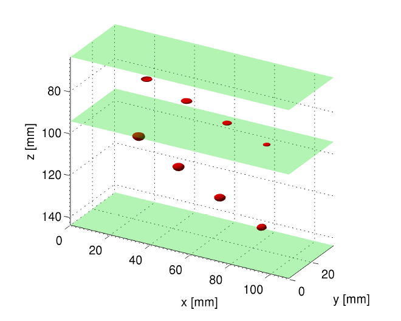

**NOTE:** This is a _draft_ version of a paper submitted to the Journal of Open Source Software (JOSS).

# Summary
`Synaptus` is a toolbox made for focusing ultrasound images. It can, however, also be used on data acquired using similar imaging principles, e.g. sonar and radar images.

Ultrasonic imaging is performed by transmitting sound waves into an object and recording how the waves are scattered. In many applications, transmission and recording are performed with the same unit, a *transducer*. If a single transducer is used, each measurement produces a vector representing the backscattered waves at a given location. By moving the transducer relative to the object of interest, a 2D or 3D map of reflections can be created.

Transducer elements can be stacked along a line or on a grid to create transducer *arrays*. By manipulating how signals are transmitted by each individual element, different shaped waves can be created, e.g. a plane wave, or a wave focused at a point. The spatial distribution of the elements also enables recording of a 2D or 3D map of reflections without moving the array as a whole.

The recordings of scattered waves represent raw data, both for single-transducer and array imaging setups. This data often suffers from poor resolution, making it hard (if not impossible) to interpret directly. The data needs to be focused in order to create an image resembling the physical structure of an object. This process - creating focused images from raw pulse-echo ultrasound data - is the purpose of the `Synaptus` toolbox.

Sonic imaging is used in many different applications, such as geophysical imaging, sonar imaging, medical imaging, and non-destructive testing (NDT) of industrial components. The methods and algorithms used in these fields are similar in many ways, but there are also significant differences in hardware, scale, and physical properties of the objects that are imaged. The software presented here was originally written as part of a PhD thesis on **ultrasound imaging for non-destructive testing** [@Skjelvareid2012b].

The thesis focused on three main points:

* Processing data in the Fourier domain (faster and sometimes simpler than procesing in the time-space domain)
* Adapting single-layer algorithms to multi-layered media, e.g. water and metal
* Adapting algorithms originally made for cartesian coordinates to cylindrical coordinates (better suited for imaging pipes from the inside)

The thesis is included in the repository and contains a full list of references. However, the most important ones will be highlighted here: `Synaptus` was greatly inspired by previous work by Tomas Olofsson and Tadeusz Stepinski at Uppsala University [@Olofsson2010, @Stepinski2007]. The underlying theory (mainly phase shift migration and Stolt migration) was originally developed for geophysical imaging [@Stolt1978; @Gazdag1978], and the free book and software on exploration seismology available through CREWES [@crewes_toolbox_2021] was also very helpful during software development. An extended (not free) version of the book is also available [@margrave_lamoureux_2019]. Finally, the book "Fourier Acoustics" by E.G. Williams [@Williams1999] was essential in developing the theory for cylindrical imaging geometries.

# Statement of need

`Synaptus` is a Matlab / Octave toolbox for creating focused images from raw ultrasonic data using the concept of synthetic aperture. The core algorithms have been written as a small set of functions that can handle many different types of datasets (2D / 3D data, single- or multilayered media, cartesian or cylindrical geometries). The code is highly vectorized, taking advantage of optimized libraries for linear algebra in Matlab / Octave. In addition, the algorithms operate in the Fourier domain, which in many cases is more computationally efficient that operating in the time-space domain ("delay-and-sum").

The toolbox includes a number of scripts that test the core algorithms by running them on a set of relevant datasets. The datasets represent a valuable resouce in themselves, given that there are very few publicly available NDT ultrasound datasets. The datasets can e.g. be used as benchmarks by researchers working on new algorithms.

The core algorithms are written to be efficient and flexible. However, the code may not be easy to understand for researchers who are not yet familiar with the theory. To accomodate those wanting to better understand the concepts, a set of scripts with simplified algorithms have been included. These scripts also produce figures showing raw data, intermediate steps and final focused images.

`Synaptus` has been available on GitHub and Mathworks File Exchange (MFE) since 2016. At the time of writing it has been downloaded over 1000 times from MFE, and 9 out of 10 reviewers have rated it 5 out of 5 stars. The author has also been contacted directly by researchers who have found the toolbox useful, including:

* Alain Plattner at California State University (Fresno, USA), who adapted the Stolt fk migration algorithm in `learn_stolt.m` for use in a course on ground penetrating radar. His adapted code is now part of the "Near Surface Geophysics" repository on GitHub [@stolt_fk_mig].
* Shiwei Wu at Zhejiang University (Hangzhou, China), who built on code from `Synaptus` in his work on imaging cylindrical objects (e.g. pipes) using an external rotating transducer [@wu2015synthetic].
* Reza Zahiri at [DarkVision](www.darkvisiontech.com) who wanted to use the algorithms in `Synaptus` to process array data, and who insipred the addition of an algorithm for processing array data.
* Drew Taylor and Prasad Gogineni at the Remote Sensing Center, University of Alabama, who have used code from `Synaptus` to focus radar measurements of ice layering in Antarctica (part of the "Beyond EPICA" project [@beyond_epica]).

A number of open source toolboxes related to ultrasound imaging are publicly available, including e.g. Field II [@field2], K-wave [@kwave] and the UltraSound ToolBox [@rodriguez2017]. However, most such toolboxes focus on medical applications, and none (to my knowledge) have implementations of the algorithms in the `Synaptus` toolbox.

The concept of synthetic aperture focusing used in `Synaptus` can be used for several modes of imaging, but the most well-known is probably synthetic aperture radar (SAR) satellite imaging. This is a huge field, both commercially and academically, and there are multiple open source software packages related to processing of SAR data available, e.g. OSARIS [@osaris] and SNAP [@snap]. However, such packages are often highly specialized for processing of radar data, making them hard to apply to other types of pulse-echo data (e.g. ultrasonic). SAR imaging is also limited to the case of a single propagating medium (vacuum/air), and SAR processors can therefore not be applied to the multilayer case that `Synaptus` addresses.

Although the toolbox was first published as a collection of algorithms and datasets developed during a PhD program, the repository is intended to be an open and live development project. Contributions in the form of datasets from new imaging geometries (e.g. differently shaped arrays or layered media) are particularly welcome, as they provide the foundation for developing algorithms for these geometries. However, contributions in the form of code, feature requests or issue reports are all very much appreciated. Given the popularity and availability of Python, a Python implementation of the toolbox algorithms is also seen as a natural continuation of the project.

# Example use
The following example was originally presented in [@Skjelvareid2012c], and is included here to give a more visual and intuitive sense of how `Synaptus` can create a focused image from raw ultrasonic data. For the sake of brevity, only a short description is given here, but the full details of the experiment can be found in [@Skjelvareid2012b].

Test blocks made of acrylic glass and aluminium were manufactured for the experiment. Each block had four flat-bottom holes
with 3 mm diameter, spaced 20 mm apart. Such holes constitute point-like scatterers during ultrasonic imaging, and enable direct evaluation of the performance of focusing algorithms. The blocks were immersed in water, and the imaging geometry as a whole thus consisted of three layers with distinct sound wave velocities; 1480 m/s, 2730 m/s and 6320 m/s for water, acrylic glass and aluminium, respectively. The test blocks were imaged using a single 2.25 MHZ, 6 mm transducer, with a 1 mm spatial sampling interval. The imaging geometry is shown in Figure 1 and 2.

The raw data from the ultrasonic scan is shown in Figure 3, with isosurfaces generated based on the responses from the flat-bottom holes. The image shows how the response from each hole is fairly broad, especially in the lowest layer. This effect is due to the width of the ultrasonic beam increasing with depth.

Figure 4 shows the focused image after processing the raw data with the PSM algorithm in `Synaptus`, visualized in the same way as the raw data. The image shows how the responses from flat-bottom holes are much narrower, indicating a higher lateral resolution in the focused image. The resolution is also independent of depth. This is a well-known feature of synthetic aperture focusing, of which the PSM algorithm is an example.

_Figure 1: Overview of experiment setup, showing acrylic glass and aluminium blocks with bottom-drilled holes, stacked on top of each other and immersed in water. (a) Seen from side. (b) Seen from above. All dimensions are in mm._

_Figure 2: 3D rendering of flat-bottom holes in stacked blocks._

_Figure 3: 3D rendering of ultrasonic raw data (envelope). Reflections from bottom drilled holes are visualized by creating isosurfaces drawn at 1/5 of the maximum amplitude within each layer._

_Figure 4: Focused image of the the flat-bottom holes in the acrylic glass and aluminium layers, created by the PSM algorithm included in `Synaptus`._

# Acknowledgements
The `Synaptus` toolbox was developed as part of PhD work by Martin H. Skjelvareid, financed in equal parts by [Breivoll Inspection Technologies](https://breivoll.eu/) and the Norwegian Research Council (project number 189624).

# References
